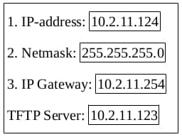

# Devices

## Recovery

### Fanvil

POST mode web page upgrade
1. Add 192.168.1.xx network segment to the computer
2. When the device is plugged in and connected to the network to start. While the mute led on, press “#” once or twice . Then mute led will be off and power LED will be green.
4. Computer login 192.168.1.179.
5. As follows: Select the upgrade file and click upgrade
6. The device will automatically restart after the upgrade is complete. When the Web prompts Rebooting, it can be powered off, and the upgrade has been completed.

### Yealink

1. Нажмите кнопку громкой связи и переподключите адаптер питания, чтобы запустить режим
восстановления. Для завершения работы следуйте указаниям мастера режима восстановления на ЖК-экране телефона. Введите значение параметров: IP-адрес, маска подсети, шлюз по умолчанию, адрес сервера TFTP в соответствующие поля.

2. Нажмите OK для завершения режима восстановления. IP-телефон загрузит и обновит прошивку с сервера TFTP. После обновления IP-телефон успешно инициализируется и будет готов к использованию после запуска.
Скриншот ЖК-экрана при успешном обновлении для справки:

